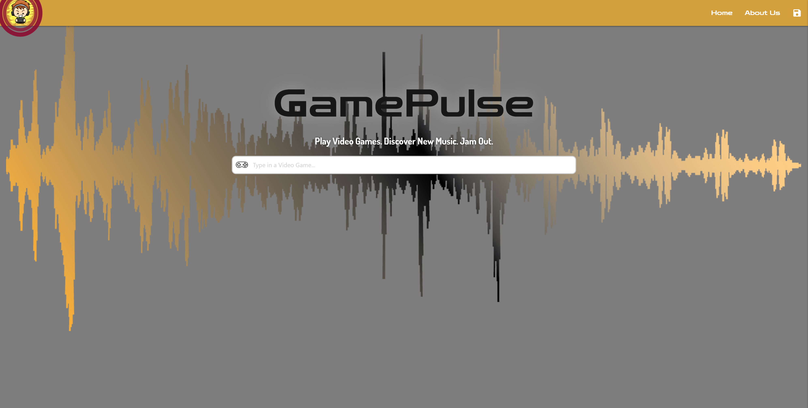
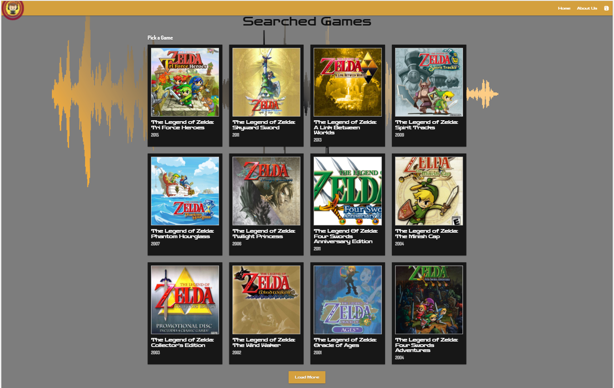

# Project-01 Game Pulse

## Task
The **Game Pulse** project is the first project assignment of the March 2021 cohort from University of New Hampshire's full-stack web developer coding bootcamp.

Create an application that allows users to search the game and display the music playlist for user selection. This app will run in the browser and feature dynamically updated HTML, CSS, JavaScript, Third Party APIs. Need to also utilize Materialize for styling.   

## User Story

As a gamer who wants to jam out instead of listening to game sounds, intrigued by the unknown, I want to have a playlist generated for my listening pleasure and discover new music while gaming.

## Acceptance Criteria

Given a Game Pulse project with form inputs

1. When I search for a game, then I am presented with thumbnails of the games.

2. When clicked on the load more button, then I am presented with more results if available.

3. When clicked on a thumbnail of a game, then results page is displayed with:
    
    3.1 Results page, **Video Game Card** :
             Game name.
             Rating.
             Release date.

    3.2 **Playlist card**:
            Spotify playlist Genres.

    3.3 Shuffle button for playlist.
    3.4 Save Pairing button to save to local storage.
    3.5 Reshuffle to just reshuffle music.

## Technologies
 - HTML
 - CSS
 - JavaScript
 - jQuery
 - Games: [GiantBomb API](https://www.giantbomb.com/api)
 - Music: [Spotify]( https://developer.spotify.com/documentation/web-api/)

## Mockup

The following image shows the web application's appearance and funcationality:

## URL of the website 
  https://unh-bootcamp-projects.github.io/project-1-group-e/

## Github link 
https://github.com/UNH-Bootcamp-Projects/project-1-group-e.git

